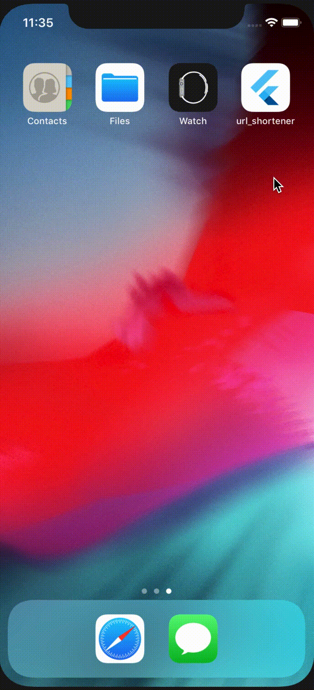

# url_shortener

url_shortener is a demo Flutter project for discovering the wonders of BLoC pattern in handling mobile application 
state. This app aims to shorten long URLs with ordinary mobile UI controls and by leveraging [Bitly](https://app.bitly.com/)'s API.

## Key Features
- [Bitly](https://app.bitly.com/)'s URL Shortener API
- BLoC State Management

## Installation
- Clone repository by running `git clone https://github.com/jaybryantc/url_shortener.git`
- After cloning, execute `flutter packages get` at the project's root directory to retrieve dependencies
- Run `flutter run` to test the app

## References
- [bloc](https://pub.dev/packages/bloc)
- [flutter_bloc](https://pub.dev/packages/flutter_bloc)
- [equatable](https://pub.dev/packages/equatable)
- [http](https://pub.dev/packages/http)

### For more Flutter stuffs. Visit [Flutter](https://flutter.dev/)'s website.
